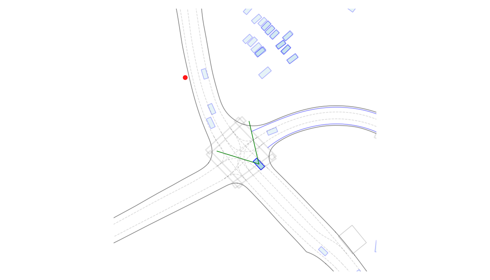

# Simple Waymo Open Motion Dataset Reader



This is a simple file reader and visualizer for the waymo open motion dataset. This is originally cloned from Verses which
in turn cloned from WAYMO repo.
```
https://github.com/waymo-research/waymo-open-dataset
```
We have added animation of scenarios from the waymo data set focusing on the ego vehicle and the suggested track 
prediction array. The animation is saved in a mp4 video file for playback - in the **data** folder. Pedestrians are
drawn as red circles, green bounding boxes are bicylists. The data is projected in 2D.

## Installation
For dependencies, you need `protobuf, tensorflow, matplotlib, numpy`:
```
pip install protobuf, tensorflow, matplotlib, numpy
```

For matplotlib you need to choose correct working env.
```
matplotlib.use('MacOSX')
```


Then install the repo:
```
pip install -e .
```

Optionally regenerate the `*_pb2.py` files from the protos:
```
sh generate_proto.sh
```

## Usage
Under the data folder there is a sample scenario record, for more data download or link to the waymo open data set.

Accessing the data set directly can be also be done:
```
FILENAME2 = 'gs://waymo_open_dataset_motion_v_1_2_1/uncompressed/scenario/training/training.<fileextension>'
```

Above is a way to access the dataset directly.

Examples of animation and dataset traversal.
```
    parse_motion_dataset.py
    count_frames.py
    animationtest.py
    zoomeffects.py
```

Parsing and visualization scripts:
```
count_frames.py             # traverse and count motion data frames per file
motion-scene-withzoom.py    # traverse and plot a zoomable subset
parse_motion_dataset.py     # parse and count pedestrians per dataset
plot_vehicle.py             # parse and animate the scenario with field of view from ego vehicle
```

python pl
## License

This code is released under the Apache License. This projects incorporate some parts of the [Waymo Open Dataset code](https://github.com/waymo-research/waymo-open-dataset/blob/master/README.md) (the files `simple_waymo_open_dataset_reader/*.proto`) and is licensed to you under their original license terms. See `LICENSE` file for details.

